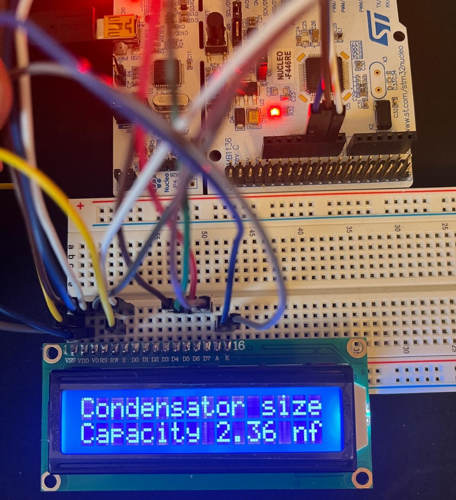

# STM32 16x2 LCD Library

This project provides a simple library for controlling a 16x2 LCD display using an STM32 microcontroller with the STM32 HAL libraries. It supports both 4-bit and 8-bit parallel modes, allowing for easy interaction with the LCD to display text and numeric values.

## Features

- Supports 16x2 LCD modules in both 4-bit and 8-bit parallel modes.
- Basic text printing capabilities with formatted numbers (similar to `printf`).
- Functions to control the cursor, clear the display, and shift text left or right.
- Predefined functions for setting cursor positions and switching between the two lines.

## Pin Layout

The pin layout configuration for the LCD is defined in the **lcd_config.h** file, which specifies the STM32 GPIO connections. The port and pin number must be specified for each pin, like in the following code.

```c
lcd_pinLayout D0_Pin = {GPIOA, GPIO_PIN_9};
lcd_pinLayout D1_Pin = {GPIOC, GPIO_PIN_7};
```

## Example

Below is an example of using this library to display a capacitor's size on a 16x2 LCD:

```c
lcd_line1();                         // navigate to line 1
cap = 2.365;
lcd_printf("Condensator size");      // print command
lcd_line2();                         // navigate to line 2
lcd_printf("Capacity %.2f nf", cap); // print value with 2 decimal numbers
```

### Expected Output

When the code is executed, the following output will be displayed on the LCD:



## Enabling Floating-Point Support for printf

By default, the printf function in STM32 projects does not support floating-point numbers (like float and double) to conserve memory and improve performance in embedded systems. To display floating-point numbers (e.g., %.2f), you need to enable floating-point support for printf. To do this, add the following linker flag in your STM32CubeIDE project settings, like in the following picture:

```
-u _printf_float
```


## Library API

### `lcd_init()`

Initializes the LCD in 4-bit or 8-bit mode, depending on your configuration.

### `lcd_setCursor(uint8_t row, uint8_t col)`

Sets the cursor position on the LCD. 

- `row` can be either 0 (for line 1) or 1 (for line 2).
- `col` can be a value between 0 and 15 for the 16-column display.

### `lcd_line1()` / `lcd_line2()`

Moves the cursor to the beginning of the first or second line.

### `lcd_deleteLine1()` / `lcd_deleteLine2()`

Clears the text from the first or second line.

### `lcd_cursorShow(bool state)`

Shows or hides the cursor on the display.

### `lcd_clear()`

Clears the entire display.

### `lcd_display(bool state)`

Turns the display on or off without clearing the characters.

### `lcd_shiftRight(uint8_t offset)` / `lcd_shiftLeft(uint8_t offset)`

Shifts the display contents right or left by the specified `offset`.

### `lcd_printf(const char* str, ...)`

Works similarly to `printf()` in C, allowing formatted text and numbers to be displayed on the LCD.

## License

This project is licensed under the MIT License. See the `lcd.c` file for more details.

---
